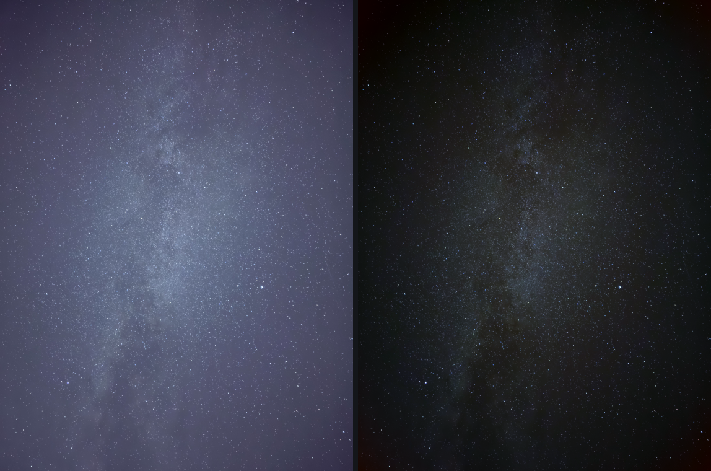

# 星景現像 (star_genzou)

スマートフォンで撮った星景写真を現像する、インストール不要のツール。
`index.html` をダブルクリックすると起動します。サーバも実行環境も要りません。

*左: 元画像（背景 RGB 80,82,108）/ 右: 現像後（背景 RGB 24,24,25）. iPhone 16 Pro Max, 10秒, ISO 2500*

## できること

- **HEIC をそのまま読める** — wasm 版 libheif を同梱しているので、変換作業が不要
- **測定値から現像条件を自動で決める** — AI は使わず、画像を測って算出
- **スライダーで即時調整** — フル解像度でも 1.7Mpx 換算 30ms 前後
- **フォルダ単位で次々に処理** — 次の1枚を先読み、画像ごとに調整値を記憶
- **結果を数値で確認** — 色かぶり、周辺色ムラ、星の太さ(FWHM)などを常時表示
- **EXIF から適否を判定** — 露出やレンズを見て「これは星空の写真か」を判断

## 使い方

1. `index.html` をダブルクリック
2. 写真かフォルダをドラッグ＆ドロップ（**フォルダ**ボタンからも選べます）
3. 自動で決まった値から微調整
4. PNG / JPEG で原寸書き出し

| 操作 | |
|---|---|
| `←` `→` | 前後の画像へ |
| `Space` 長押し | 元画像と見比べる |
| ホイール | 拡大・縮小 |
| ドラッグ | 移動 |

## ファイル構成

| | |
|---|---|
| `index.html` | UI。これを開けば動きます |
| `develop.js` | 現像の中核。依存なし・DOM非依存で、Node でもそのまま動きます |
| `metrics.js` | 品質の測定。UI と CLI で同じコードを使います |
| `exif.js` | 撮影情報の読み取り。JPEG / HEIC 両対応 |
| `heic.js` | libheif (wasm 内蔵ビルド) |

`develop.js` は外部依存ゼロの純粋な数値計算なので、Go や Rust への移植も容易です。
`metrics.js` が移植の検証（同じ入力で同じ数値が出るか）に使えます。

## 現像の流れ

1. **sRGB → リニア** — カブリは「足し算」なので、リニアでないと正しく引けません
2. **地上と空の分離** — 地上込みで空を推定するとモデルが壊れます
3. **カブリ除去** — 星を避けて空のグラデーションを多項式で推定し減算
4. **色かぶり中和** — RGB の背景レベルを揃える（「黒が黒になる」の実体）
5. **周辺の色転び補正** — 輝度に触らず、色差の半径依存だけを除去
6. **黒点とストレッチ** — 出力ノイズが予算を超えない強さを逆算して適用
7. **彩度・カラーノイズ処理**

## 設計上の判断

実装中に測定で判明し、方針を変えた点です。

- **周辺減光を輝度で補正してはいけない** — 天の川が画面中央にあると「中心が明るい＝減光」と誤認して天体を消します。輝度に触らず色だけ補正します。
- **カブリの次数は上げない方がよい** — 次数を上げると天の川そのものをカブリとみなして消します。既定は1（平面）です。
- **背景モデルを空の観測範囲外に外挿しない** — 地上の領域は外挿になるため、そのまま引くと地上が真っ黒に潰れます。
- **色補正の強さは好みではなく測定値** — 中間値が最良になる画像が1枚も無かったため、スライダーではなく on/off にしました。実効値は背景の測定信頼度に比例します。
- **復元できない画像は処理しない** — 入力の黒つぶれが 40% を超える画像は、持ち上げてもノイズが暴れるだけなので素通しします。

## 測定できること・できないこと

| 指標 | 何を捉えるか |
|---|---|
| 色かぶり | 背景の R/G/B のズレ |
| 周辺色ムラ | 四隅と中央の色差。処理の破綻はここに出ます |
| 星の太さ (FWHM) | 過処理（肥大・ぼけ）の検出 |
| 背景ノイズ / 黒つぶれ | 情報を捨てていないか |

既知の欠陥を注入して検証済みです（周辺の色転び・黒つぶれ・ぼかし・階調の段付き・星の肥大を検出）。

ただし **単一の指標で良し悪しを判断すると間違えます**。色かぶりが 0 で最良に見えるのに、
周辺色ムラが 19 で実際には破綻している例が実在しました。必ず複数を並べて見てください。

**検出星数は絶対値として信用できません。** 閾値が背景ノイズに依存するため、
黒を潰しただけの画像で 12 倍に化けます。同じ画像内での比較にのみ使えます。

また、これは「良い写真かを判定する点数」ではなく「処理の破綻を検出する回帰テスト」です。
美的な良し悪しは測れません。

## 向き不向き

iPhone 16 Pro Max で撮影した 27 枚での実測です。

| 条件 | 結果 |
|---|---|
| 露出 10 秒 / ISO 2500-3200 | 安定して良好（色かぶり 18〜26 → 1〜2） |
| 露出 1〜2 秒 / ISO 6400-12500 | 引き出せる階調が限られます |
| 入力の黒つぶれ 40% 超 | 復元不能。素通しします |

**地上が大きく入る構図では、まだ精度が落ちます。** 27 枚中 6 枚で数値が悪化しました。

## ライセンス

同梱の `heic.js` は [libheif](https://github.com/strukturag/libheif) (LGPL) のビルドです。
それ以外のコードは MIT とします。
